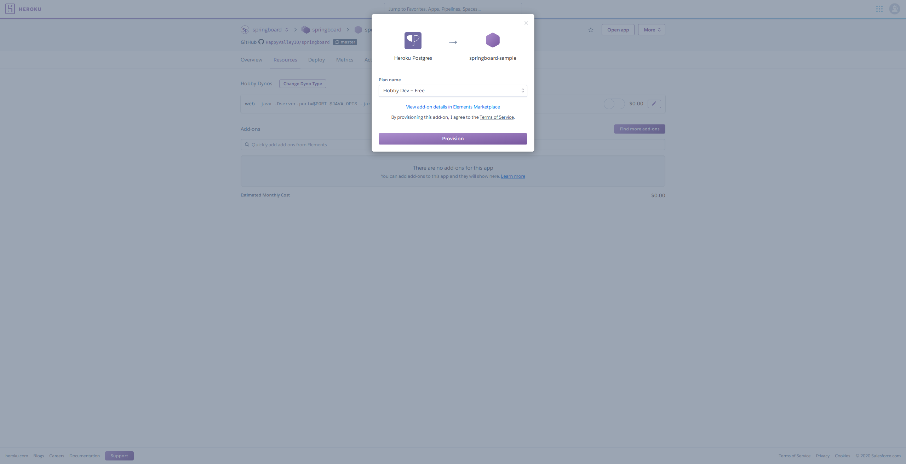

# Deploying to Heroku

[Heroku](https://www.heroku.com) is a PaaS product that makes deploying your application easy. With its generous free tier it's a perfect way to kick off a new project.

It's easy to deploy a Springboard application with Heroku. We can also benefit tremendously from the Heroku add-on ecosystem:

* [mailgun](https://mailgun.com) as an SMTP server to send emails;
* [sentry](https://sentry.io/welcome/) for error-tracking;
* [logdna](https://logdna.com/) for log aggregation; and 
* [hosted postgresql](https://www.heroku.com/postgres) as a data store.

You can check the other add-ons heroku comes with out of the box [here](https://elements.heroku.com/addons).

## Minimum Viable Deployment

There are a couple of ways that we can deploy to Heroku - they maintain excellent docs on this [here](https://devcenter.heroku.com/categories/deployment). 
The deployment mechanism we'll be focusing on is the GitHub integration. We'll be building out a production-ready pipeline here. 
We'll connect our app to a Springboard based GitHub repo and deploy the application with a database.

One of the primary benefits to working in Springboard is simplicity of building and deploying. It's a single, stateless JVM 
instance that's connected to a database. Most of the tricky first-time setup has already been done in the gradle build scripts. 
As such, anything that can deploy a Spring Boot project can deploy a Springboard project without difficulty. 

As it happens, Heroku has terrific integration with Spring Boot so deploying a live, production-ready application is pretty simple.   

I'm going to presume you've signed up to a Heroku account, if you haven't [then do so](https://signup.heroku.com/), login to the Heroku dashboard and get ready to go. 

### Step 1: Create a Heroku App

If you've just signed up to Heroku you'll be presented with an empty dashboard. On this page, click the `New` button and select `App`.

[](images/heroku-empty-dashboard.png)

This will take you to the create application page:

[](images/heroku-create-app.png)

When there, fill in the details for your application and hit `Create App`. This will take you on to your new app page:

[](images/heroku-created-app.png)

Hooray! An app is born!

### Step 2: Create a pipeline and deploy

Now, our app doesn't actually do anything yet. Let's fix that.

You'll be prompted to add this app to a pipeline at the top of the page. Click to create a new pipeline and fill in the details:

[](images/heroku-create-pipeline.png)

This will forward you on to the newly created pipeline:

[](images/heroku-pipeline-created.png)

When here, click the prompt to `Connect to Github`. If you don't see this prompt, then navigate to the `Settings` tab. Once on this page, search for your GitHub repo then connect.

[](images/heroku-pipeline-connected.png)

While you're here, I'd really recommend enabling [review apps](https://devcenter.heroku.com/articles/github-integration-review-apps). You can see the settings we recommend in the image below:

[](images/heroku-review-settings.png)

They'll give you a great way to interact with pull request changes before merging. Springboard comes with an `app.json` file configured that specifies the required postgres database for your review apps. If you'd like to add other addons for each review app, then you can do so by modifying `app.json`. Heroku will respect the changes on the next deploy.

### Step 3: Enable automatic deploys

Navigate back to the `Pipeline` tab to see the new setup.

[](images/heroku-pipeline-with-review.png)

We'll add a staging environment here later. For now, let's enable automatic deploys. Click the menu toggle button on the production app.

[](images/heroku-pipeline-deploy-settings.png)

And click `Configure automatic deploys...`. You'll be presented with some options. We recommend deploying master only after CI passes. 

[](images/heroku-automatic-deploys.png)

And we're set! This means that the next time we merge into `master` we'll see our application automatically updated!

### Step 4: Making a change

Let's make a tiny change. I've added a new empty line between two tags in `src/webapp/src/templates/pages/index.peb`. You could do something more dramatic here of course.

Commit this change on a feature branch `feature/example` and push to github. Now go to your repo in the browser and you'll 
be prompted to open a pull-request. Click the `Compare & pull request...` button, fill out the form on this page and then 
create the pull request. 

[](images/github-pull-request-ci-running.png)

Alright! Now go make a cup of coffee while the CI build runs. Springboard has a longer build than a base Spring Boot project, 
but we promise it's worth it. Right now GitHub is running unit, integration and feature tests on the back-end and has 
kicked off Cypress to test your front-end. Once it's done, you should see something like this:

[](images/github-pull-request-review-created.png)

Click the `View deployment` button and... Ta-da!

[](images/review-app-deployed.png)

Our review app is live! This has its own Heroku Postgres instance spun up, so we can play around with it without impacting 
a shared database. Note: we've still not finished the setup for our production app yet - read on to finish the required setup.

### Step 5: Merging to master and deploying to production

Now we've done some QA on our review app, we'll merge the pull request and deploy to production. Normally, this is 
where a teammate would review our change, but for now we can safely click the `Merge` button and carry on solo.

Upon merging the pull request, the review app instance will be spun down - saving us some money/free dyno hours. At this point you can head back to the heroku pipeline to view the deploy logs.

[](images/heroku-deploy-logs.png)

Give it a couple of minutes to run and your app will be deployed! You can also check in on the deployment in the GitHub environment screen, by clicking the `environments` button on your repo's home page.

[](images/github-env-pending.png)

Once the app has been deployed, this will change to read `Deployed`. 

Click the `View deployment` button...and it's broken! Why did production break when the review app works? 

Springboard comes with an `app.json` file that acts as a configuration for Heroku review apps. This file contains configuration 
for our postgres database so that Heroku knows to spin one up for each review app. Unfortunately, the `app.json` file 
doesn't have any impact on production, so we'll have to do the initial setup manually. This is a one-time thing. 
Automated provisioning of these resources is out of the scope of this tutorial, but you could checkout the 
[Heroku docs on Terraform](https://devcenter.heroku.com/articles/using-terraform-with-heroku) if it's something you're interested in.

### Step 6: Spinning up the production database

Navigate over to the application in Heroku and go to the resources tab:

[](images/heroku-resources.png)

And provision a free database:

[](images/heroku-postgres-free.png)

Now click `More` at the top right and `Restart all dynos`. Now - after the restart completes - we can try clicking `Open App` again...

[](images/deploy-success.png)

Success! Our app is now live in production!

### Step 7: Reflect on the result

To conclude, we now have:

* an automated process that runs all of our tests for a pull request;
* on test success deploys the pull request code to a unique, isolated environment;
* on merge deletes the review application automatically; and
* deploys the change to production.

This is incredibly powerful. Whether you're working solo or in a team, we think having a way to easily review and trial changes before 
letting a customer get access to them is the way forward. There's more yet to do though! Continue on below to allow your application to send email,
report errors to sentry and to have a long-lived staging environment for QA.

## Connecting the CLI

So far, everything we've done has made use of the Heroku website. Moving forward, we'll be provisioning extra add-ons using the [CLI](https://devcenter.heroku.com/articles/heroku-cli). This makes simple tasks much easier and gives us access to some more tooling
 - such as being able to stream logs with `heroku logs --tail`.

Use the [documentation](https://devcenter.heroku.com/articles/heroku-cli) to install and login to the CLI before going forward.

Once you have the CLI installed, navigate to your project in the terminal and run `heroku git:remote -a $MY_PROJECT_NAME` 
where `$MY_PROJECT_NAME` is the name of your heroku app. You should see output like the image below:

[](images/cli-setup.png)

And you're set!

## Adding Mailgun

Now we have a live application, we'd like to make use of the other features that Springboard gives us
out of the box. First up: email. We're using Mailgun here, but since Springboard leverages spring-mail (which in turn just 
uses SMTP) you can feel free to substitute for your favourite SMTP email provider.

### Step 1: Adding Mailgun to your production application

Navigate to your project on your machine and run the following command:

```bash
heroku addons:create mailgun:starter 
```

You'll see output like the following:

[](images/added-mailgun.png)

Looking at this output, we see that the Mailgun add-on has added a bunch of environment variables to our application. 
We'll need to update our app to reflect this... right?

### Step 2: Updating application to use env variables

Wrong! Head over to `src/main/resources/application.properties` in your editor of choice. You'll see we have some properties 
that rely on the `MAILGUN_` environment variables we've just configured:

[](images/mail-settings.png)

Great! This means that we don't have to do anything else to make this work. If there are `MAILGUN_` env variables then 
we'll send email successfully. If these variables aren't passed at runtime, then Springboard will silently fall back on a 
`LoggingMailSender` that just logs each message.

If you decided to use a different mail provider, you'll be able to modify these settings to respect whatever environment variables
that add-on injects in this file. This is out of the scope of this tutorial.

## Adding JVM metrics

Heroku offers [language specific metrics](https://devcenter.heroku.com/articles/language-runtime-metrics) for applications 
running on any paid dyno tier (so Hobby and up).  

This includes JVM specific metrics around things like garbage collection and heap usage. You can read more about the JVM specific metrics 
on offer [here](https://devcenter.heroku.com/articles/language-runtime-metrics-jvm).

### Step 1: Adding the metrics to the app

We'll be adding the JVM metrics integration to our production app. To enable these metrics, navigate to your app in the 
terminal and run `heroku labs:enable "runtime-heroku-metrics"`. This should result in output:

[](images/enable-metrics-cli.png)

Once that's done, you must re-deploy the dynos for the app. You can do this by running the `heroku dyno:restart` command 
in the terminal. This will result in output:

[](images/heroku-restart-cli.png)

It will take a few minutes for these metrics to show up so feel free to stop here for a cup of coffee.

### Step 2: Viewing the metrics

Head back to your Heroku app in the browser and open the `Metrics` tab.

[](images/heroku-metrics-screen.png)

On this page you'll see a bunch of metrics about your app in production. These include metrics around requests per second, 
request latency and more. If you scroll down then you should see the newly added JVM metrics:

[](images/heroku-jvm-metrics.png)

And that's it! It's due to this kind of simplicity that we love Heroku.

## Adding staging

TODO

## Adding Sentry

Production monitoring is a tricky thing to get right. A great starting point in our opinion is enabling Sentry to track 
errors both on the app server and in the user's browser. Springboard comes with Sentry pre-configured so it's as easy as 
turning it on!

### Step 1: Enable sentry in Heroku

Heroku has a [Sentry add-on](https://elements.heroku.com/addons/sentry) that works with Springboard out of the box. To 
enable it, navigate to your project in the terminal and run: `heroku addons:create sentry:f1`. You'll get output:

[](images/enable-sentry-cli.png)

Now let's restart our dyno using the `heroku dyno:restart` command. Go have a cold glass of water. This'll be done by the time you're back.

### Step 2: Viewing our new dashboard

The Heroku CLI gives us a convenient way to access our Sentry instance. Run `heroku addons:open sentry` and be amazed as your 
browser opens and uses single-sign-on to log you in.

[](images/sentry-dashboard.png)

There won't be any activity here yet. Let's head over to our application and throw an error.

### Step 3: Throwing an error

Springboard integrates with Sentry at two points. It configures Sentry for Spring so that any unhandled exceptions on the server 
are recorded, and it adds a JS snippet to the rendered page in the browser so that we track any JS errors client-side. Let's leverage the 
latter to throw an error. Open the developer tools in your favourite browser and throw an error for Sentry:

[](images/error-thrown.png)

And see it appear in the Sentry dashboard:

[](images/sentry-with-error.png)

Ta-da!

### Step 4: (Optional) Integrate with Sentry release

By integrating with the Sentry release functionality we can see useful information about which version of our application
is throwing errors. 

#### Easy option
We recommend using the [Heroku Labs: Dyno Metadata](https://devcenter.heroku.com/articles/dyno-metadata) functionality in Heroku
to have the commit SHA env variable available at runtime. We run the command `heroku labs:enable runtime-dyno-metadata`,
then redeploy the application by making a small change and pushing to GitHub or by using the Manual Deploy button in the 
application's deploy settings on Heroku itself. Once this is done, you can run the `heroku config` command to see the commit SHA
being passed as an env variable:

[](images/heroku-config-release.png)

By default, Springboard allows source maps in production - see motivation 
[here](https://m.signalvnoise.com/paying-tribute-to-the-web-with-view-source/) - which makes debugging errors in production a little easier. 

Despite this, we recommend hooking [Sentry up to your GitHub repo](https://docs.sentry.io/workflow/integrations/global-integrations/#github) 
so that it can show the source code for errors thrown. If you don't use GitHub then there are alternatives with 
documentation [here](https://docs.sentry.io/workflow/integrations/global-integrations/#issue-management).

#### Harder option

Sentry recommends using GitHub actions to set up Sentry with runtime information and releases. We haven't gotten around to 
doing this for Springboard yet, but you can follow their guidelines [here](https://blog.sentry.io/2019/12/17/using-github-actions-to-create-sentry-releases).

## Adding LogDNA

[LogDNA](https://logdna.com/) is a log aggregation product that includes a bunch of nice features at a reasonable price. 
If you'd like to use something else, then feel free! Springboard logs to STDOUT in a JSON format in production, so you should 
be able to use almost any log aggregation product. 

We'll be using the Heroku add-on to [deploy this](https://elements.heroku.com/addons/logdna).

### Step 1: Enabling the add-on

First, let's run the Heroku CLI command `heroku addons:create logdna:quaco` to enable the free tier of LogDNA:

[](images/heroku-cli-logdna.png)

Nothing more to see here really.

### Step 2: Opening logdna

Let's use the Heroku CLI to open LogDNA. Run `heroku addons:open logdna` in the terminal in your application directory and 
you'll be taken to LogDNA:

[](images/logdna-dashboard.png)

Huzzah! Here we can see everything that's logged by every running dyno for our production application. There are a bunch of features 
in LogDNA that are worth exploring. You can find out more in their [documentation](https://docs.logdna.com/docs).

Log aggregation doesn't depend on much in the way of application behaviour, so there's nothing specific to Springboard here really.

