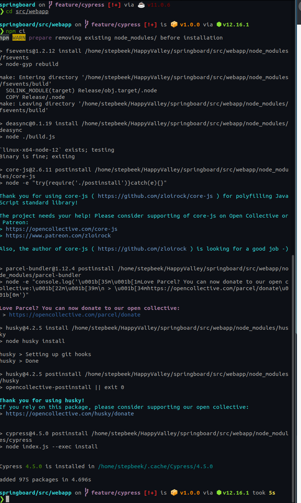
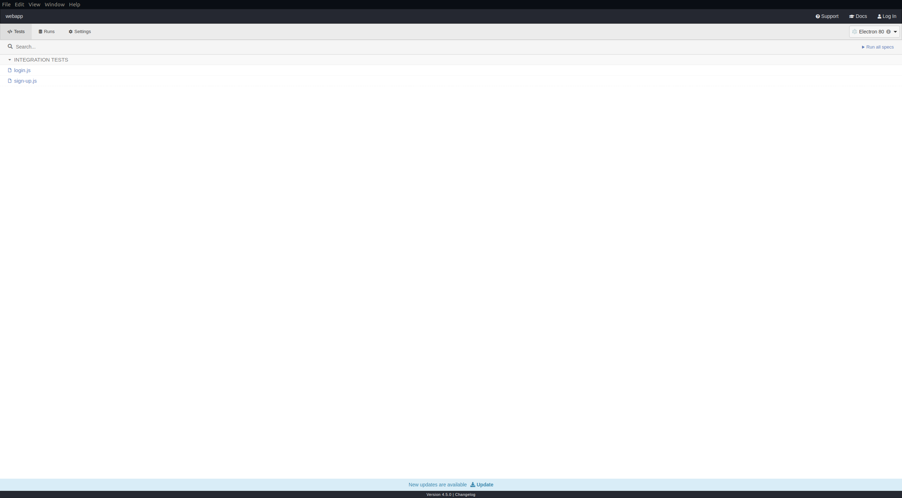
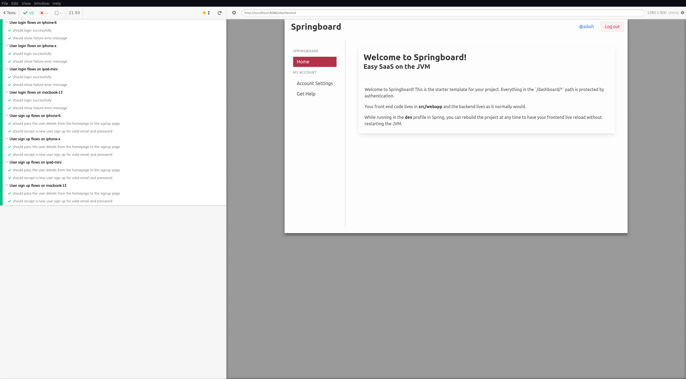
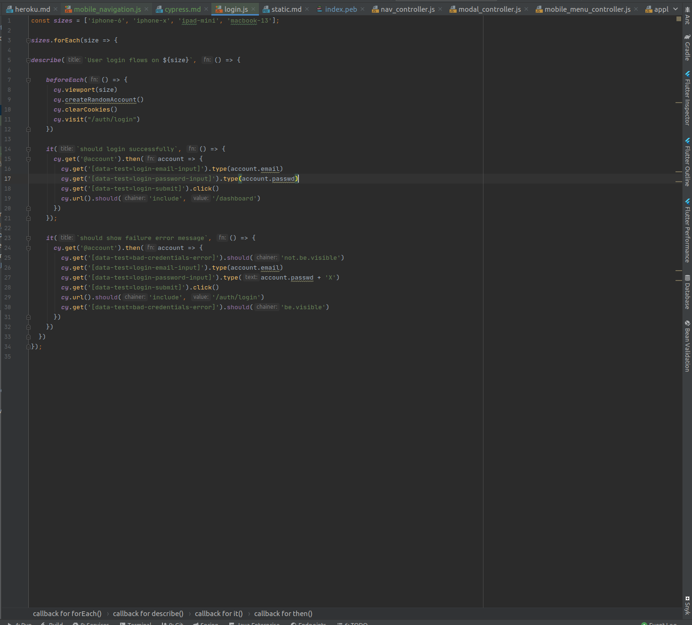
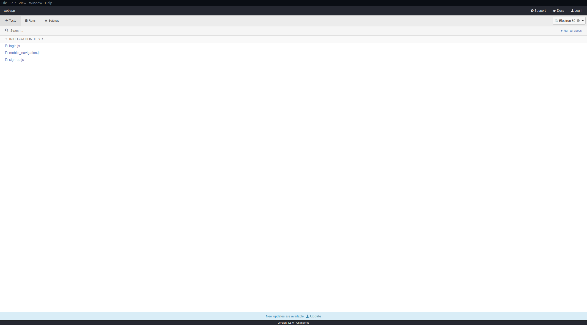
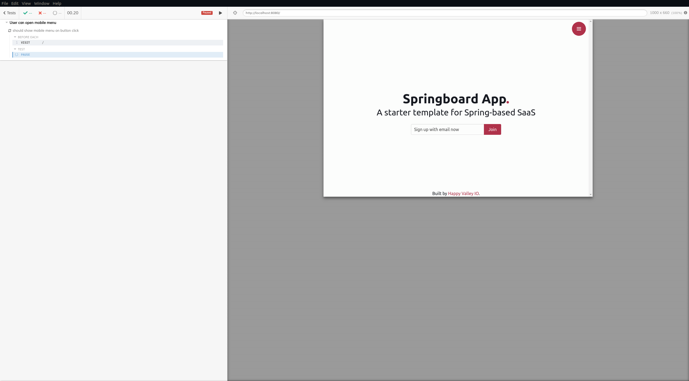
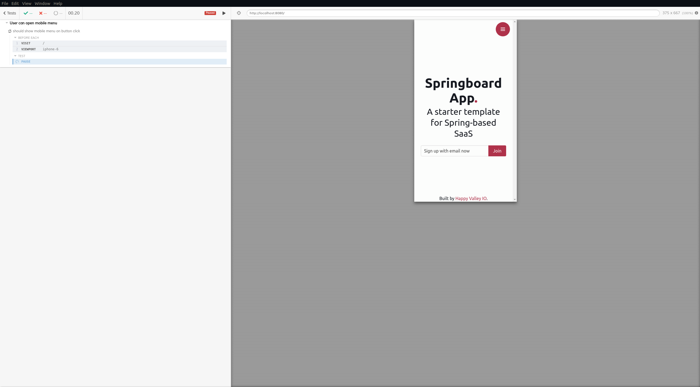
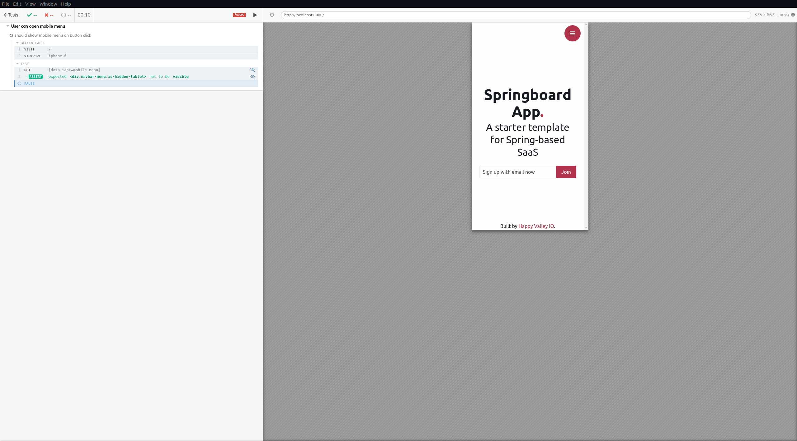
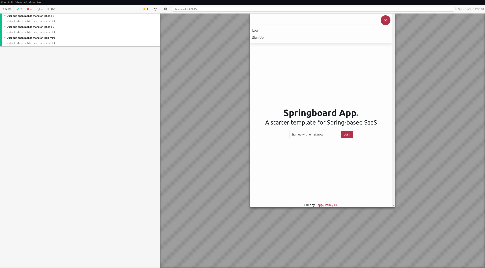
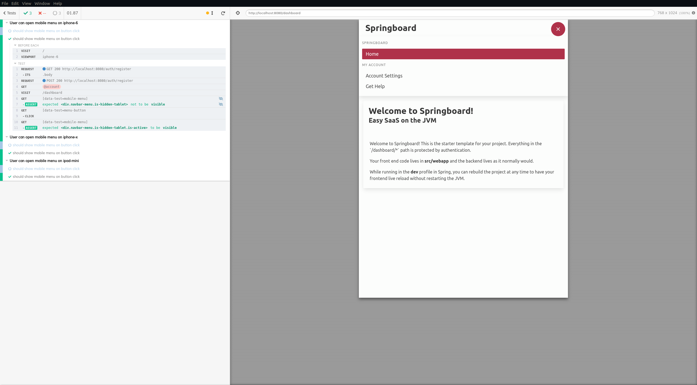

# Testing our front-end with Cypress

> "No one shall expel us from the Paradise that Cypress has created."
>
> -- Me, right now

We love [Cypress](https://www.cypress.io/), and after this tutorial we're sure you will too. 

If you've never encountered Cypress before, it allows us to write fast, functional, front-end tests that run in an actual browser
using standard js tooling. It has a very gentle learning curve if you're already comfortable writing front-end code, and 
a moderate one if you are not.
  
If you've never used Cypress before, then we recommend reading through [their docs](https://docs.cypress.io/guides/getting-started/writing-your-first-test.html#Add-a-test-file)
as well as this. While we'll cover some basics in this tutorial, we'll really just be skimming the surface to show how Cypress
fits in to koil.

## Creating and running a Cypress test

### Step 0: Installing Node.js

If you already have Node 12, then feel free to skip this.

Cypress needs Node.js to run. Normally, when you build a koil project, gradle will pull down the required node version
and use it to build your front-end assets. To install Node.js on your machine for use globally, we recommend using the 
[Node Version Manager](https://github.com/nvm-sh/nvm) to install the latest LTS version of node (`nvm install --lts`).

Once that's done, navigate to the `src/webapp` directory in your koil project and run `npm ci`:

[](images/npm-ci.png)

This installs the dependencies you need at the same version that we used when creating koil. 

While `npm install` will work, it will also update a bunch of dependencies. In a perfect world, no breaking change would find its way into 
a minor version update. Alas, we don't live in a perfect world, and so we've found it better to use `npm ci` unless we're 
explicitly trying to update. This might be a little slow the first time (you'll also be pulling down the 
Cypress binaries) it runs, so feel free to stop here to have some punch and pie. 

### Introducing the Cypress test runner

First up, we'll presume you have a koil project ready to go and that you've got a working node environment. 
In the `src/webapp` directory, run the `npx cypress open` command, and you'll be greeted with the Cypress runner:

[](images/cypress-runner.png)

We can see that we have a couple of test specs already here. If you click the button labelled `Run all specs` at the top right 
a new window will open, and you'll see some automated UI tests run:

[](images/cypress-initial-run.png)

These are some basic tests we've included to verify registration and login flows. This runner window is where we'll be spending most of 
our time as we write our tests. If we open `src/webapp/cypress/integration/login.js` we'll see some of the test cases that just
ran:

[](images/cypress-login-spec.png)

There are a couple of things to pay attention to here:

* we're using the [Mocha](https://mochajs.org/) test framework which Cypress comes with out of the box;
* we're looping over an array of device names to generate tests for different device sizes;
* we're using a custom command to create a new account in the before each (which you can find in `src/webapp/cypress/support/commands.js); and
* our tests are written in plain ol' javascript.

You'll be using these techniques going forward to write a specification testing the mobile menu button on the index page.

### Creating our test spec

In the `src/webapp/cypress/integration` directory, create a new file called `mobile_navigation.js`. In your favourite editor,
add some boilerplate code:

```js
describe(`User can open mobile menu`, () => {
    beforeEach(() => {
      cy.visit('/')
    })

    it(`should show mobile menu on button click`, () => {
        cy.pause()
    });
});
```

Now, let's go back to the Cypress Runner. You should see a new spec file is listed:

[](images/runner-with-new-file.png)

Click on the file name `mobile_navigation.js` and you'll be taken to the running tests:

[](images/runner-paused.png)

Alright! This test is on the index page and is currently paused. This is because of the `cy.pause()` statement in our test
case body (line 7 if you copy-pasted). You can click the play button at the top of the left-pane to resume. Adding some 
pause lines into tests when debugging is a great way to step through in increments.

### More meaningful test case

Our test above doesn't really do anything, so let's fix that. First, consider that we're trying to test a bit of functionality 
on mobile, but the test is running on what looks like a laptop screen size. In the `beforeEach` of the spec file add a line to change viewport:

```js
    beforeEach(() => {
        cy.visit('/')
        cy.viewport('iphone-6')
    })
```

Now when we run our test we'll see that Cypress is running on a screen with the same resolution as an iPhone 6:

[](images/cypress-viewport-changed.png)

Pretty easy! The next thing we'd like to do is to assert that the menu isn't visible when we first arrive on the page. 
There are a bunch of ways to refer to an element in Cypress (by using normal CSS selectors), but we strongly recommend 
using `data-test` attributes as advised [here](https://docs.cypress.io/guides/references/best-practices.html#Selecting-Elements).

Head on over to the index page template at `src/webapp/src/templates/pages/index.peb`. You'll see on line 21 that we already 
have a data-test attribute:

```html
            <div class="navbar-menu is-hidden-tablet" 
                  data-target="toggle.toggleable" 
                  data-test="mobile-menu">
                <div class="menu">
                    <ul class="menu-list">
                        <li><a href="/auth/login">Login</a></li>
                        <li><a href="/auth/register/company">Sign Up</a></li>
                    </ul>
                </div>
            </div>
``` 

That is, `data-test="mobile-menu"`. To assert that it's not visible, let's add a line to our test case:

```js
    it(`should show mobile menu on button click`, () => {
        cy.get('[data-test=mobile-menu]').should('not.be.visible')
        cy.pause()
    });
```

When you save this file, the open runner will re-run the test automatically. You'll see in the left pane that an assertion
ran before pausing this time:

[](images/cypress-single-assertion.png)

Neat! Now let's add in a couple more actions for our test to take. We want to click the menu button and assert that a menu is now visible.

If you return to `src/webapp/src/templates/pages/index.peb`, you'll see that our menu button already has a test attribute `data-test="menu-button"`.
Using this in our test, we get:

```js
    it(`should show mobile menu on button click`, () => {
        cy.get('[data-test=mobile-menu]').should('not.exist')
        cy.get('[data-test=menu-button').click()
        cy.get('[data-test=mobile-menu]').should('be.visible')
    });
```

To clarify what's going on here: we're getting the `menu-button` element and clicking it. Then we're selecting the `mobile-menu` again and verifying that it's visible.
To give this a BDD slant, the test would read `GIVEN the mobile menu isn't visible WHEN the menu button is clicked THEN the mobile menu is visible`.

And we're done! We can now say with confidence that the menu works on mobile.

### Running on more devices

A favourite trick of ours is to run a cypress test for a variety of different viewport sizes. This saves a bunch of time 
in verifying that our website works across screen sizes without manual QA.

Add a device array to the top of the file:

```js
const sizes = ['iphone-6', 'iphone-x', 'ipad-mini'];
```

We'll loop over this array, and add the existing test contents to the inner loop:

```js
const sizes = ['iphone-6', 'iphone-x', 'ipad-mini'];

sizes.forEach(size => {
    describe(`User can open mobile menu on ${size}`, () => {
        beforeEach(() => {
            cy.visit('/')
            cy.viewport(size)
        })

        it(`should show mobile menu on button click`, () => {
            cy.get('[data-test=mobile-menu]').should('not.be.visible')
            cy.get('[data-test=menu-button').click()
            cy.get('[data-test=mobile-menu]').should('be.visible')
        });
    });
})

```

Note we've made two other changes here:

* we've added the size parameter to the describe string of our spec; and
* we've modified our `beforeEach` to call `cy.viewport(size)`.

This results in:

[](images/cypress-running-test.png)

Sweet! Note that the test names now include the device preset name. To see more viewport aliases you can add, checkout 
[this page](https://docs.cypress.io/api/commands/viewport.html#Arguments).

## Testing functionality that requires authentication

Frequently, we need to create a test account, log in as that user, and interact with some functionality only available to authenticated
users. To help with this, we've created a custom cypress command `cy.createRandomAccountAndLogin()`. As an example of it in use,
we''ll be adding another test case to the `mobile_navigation.js` file:

```js
        it(`should show mobile menu on dashboard`, () => {
            cy.createRandomAccountAndLogin();

            cy.get('[data-test=mobile-menu]').should('not.exist')
            cy.get('[data-test=menu-button').click()
            cy.get('[data-test=mobile-menu]').should('be.visible')
        });
```

The navbar used on these pages has been given the same attributes that we used before: `data-test="mobile-menu"` and `data-test="menu-button"`.

If you step through this test, you'll see that it makes some `POST` requests to create the account then navigates to `/dashboard`.

[](images/cypress-authenticated.png)

This is much preferred to working through these flows as a user would. We have tests that explicitly verify the authentication 
already, so any benefit to going through that process every time would be marginal. On the other hand, we'd be paying the 
cost with slower tests down and tighter coupling between the UI authentication flows and tests that don't really care what 
the auth UI looks like.

## Running the test suite in JUnit

While the Cypress test runner is a great tool, we don't really want to have to open it every time we make a change. Instead,
we probably just want these tests to run as a part of our normal test suite. Inspired by [this blog post](https://www.wimdeblauwe.com/blog/2019/2019-06-15-running-cypress-tests-with-testcontainers-for-a-spring-boot-with-thymeleaf-application/),
we've written a JUnit test class that will run our entire suite.

> Note: the author of the blog post above has also [released a library](https://github.com/wimdeblauwe/testcontainers-cypress/tree/testcontainers-cypress-0.4.0) 
> to do a lot of the work for us. We're working on integrating this with koil soon.


You can find this test at `src/test/kotlin/org/koil/CypressIntegrationTest.kt`

This test will also be run as a part of a `gradle build`, making our CI runs super easy. 

#### Caveat
A fairly natural next step here might be to write test setup code (e.g. create used account) in the JUnit test. We don't recommend this.
Not only does it make running the test without JUnit very difficult, it also couples us quite tightly to this implementation
as a Spring-based monolith. One of the primary benefits to Cypress testing in the way we advocate is that our tests are 
very loosely-coupled to the implementation of our application. We'd be loathe to lose that.

## Conclusion

Well there we have it. A browser-based front-end test that runs automatically as a part of our build. As mentioned at the 
beginning, if you've not used Cypress before then we highly recommend digging in on their [website](https://www.cypress.io/). We think you'll be impressed. 
