# Getting Started with Springboard

This is a guide to actually starting your first project with Springboard- step by step instructions from pulling the
project down, getting it running for the first time and a few ways to start customizing it to be your own project.

We use IntelliJ as our IDE so the instructions given below assume you have IntelliJ as well. If you want a tutorial
using another IDE, let us know and we can add it!

This tutorial intentionally goes step-by-step through common errors or mistakes someone might make while trying to get the project running.
If you are an experienced developer- some of it might seem obvious and unnecessary to you.

## Pulling the Project form GitHub
This might be an obvious one- but use the git clone command to pull down the Springboard Project.

```bash
git clone git@github.com:HappyValleyIO/springboard.git rvroger
```

## Getting it to Run (Short Version)

This is the quick version to get Springboard to run successfully for the first time. If you want a bit more of an
explanation of possible errors or why you are making changes - checkout the long version [here](#getting-it-to-run-long-version)

- Run the docker-compose up -d command in the folder that you've cloned the project into
- Open the project in Intellij. Wait for it to import the Gradle project. (2 minutes on a beefy computer)
- Run the SpringbootApplication
- Edit the Run Configuration while it builds the project (the initial build took just under 3 minutes on a beefy computer). You need to add the environment variable for running in Spring DEV (SPRING_PROFILES_ACTIVE=dev) to the configuration.
- Once the build finishes, the initial SpringBootApplication run will have failed. Now re-run it with your newly saved environment variables
- You should now be able to go to localhost:8080 and see the project running successfully.

## Getting it to Run (Long Version)
Now we have pulled down the Springboard project, let's open it in your favorite IDE. I'm going to be using IntelliJ.

- Open IntelliJ
- File -> Open -> rvroger

This is going to import the "rvroger" Gradle project. It can take a few minutes to pull in all the dependencies.
 It's tempting to click "Background" on the task and start changing things, but go make a cup of tea or coffee and 
 just let it finish. (It took 2 minutes and 19 seconds for my computer to finish getting everything setup)

Now let's run the application and see what we have. If you open "src/main/kotlin/org.springboard" and right click
 SpringboardApplication.kt, the "Run" option should be available in the menu (or if you are a shortcut wizard -
  "CTRL + SHIFT + F10"). Since this is the first time you will have built the project, it is going to take a bit of 
  time to run. The "buildAssets" step in particular will take up the majority of this time. Mine took another 2 
  minutes and 46 seconds to finish the build.

Now IntelliJ has finished the build- it's going to start running our application!

Anddd we get a horrible error blowup:

[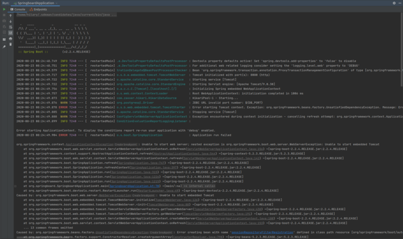](images/getting-started-missing-dev.png)

If we drill down and read the stack trace- we see the root cause here: 

```
Driver org.postgresql.Driver claims to not accept jdbcUrl, jdbc:postgresql://${DB_SERVER}:${DB_PORT}/${DB_NAME}
```

Take a look at our main resources- we have application.properties and application-dev.properties. By default, Spring
 is going to pick up application.properties, which, if we open it, expects to find environment variables for the 
 database configuration. 
 
 [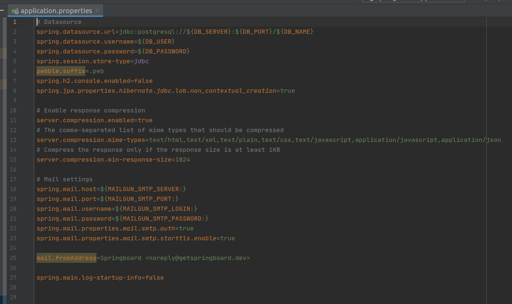](images/getting-started-application-properties.png)

We are just trying to run a development instance here- so looking at application-dev.properties, it's already 
configured some test database properties. 
 
 [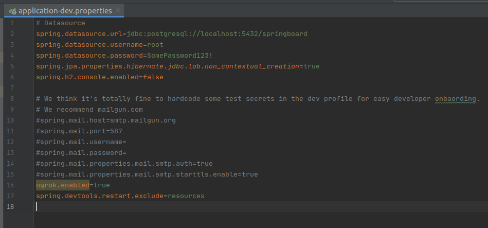](images/getting-started-dev-application-properties.png)
 
Since the DEV application properties file contains everything we need to run a local development instance of our 
application, we need to make sure that this is the file being picked up when we run. Let's edit the Run Configuration 
for SpringboardApplication so that it uses the DEV spring profile. Since we tried  to run this already- 
IntelliJ has a Run Configuration setup for us if we "Edit Configurations" from the run configuration menu.
  
We need to add an environment variable:
```
SPRING_PROFILES_ACTIVE=dev
```
 
 [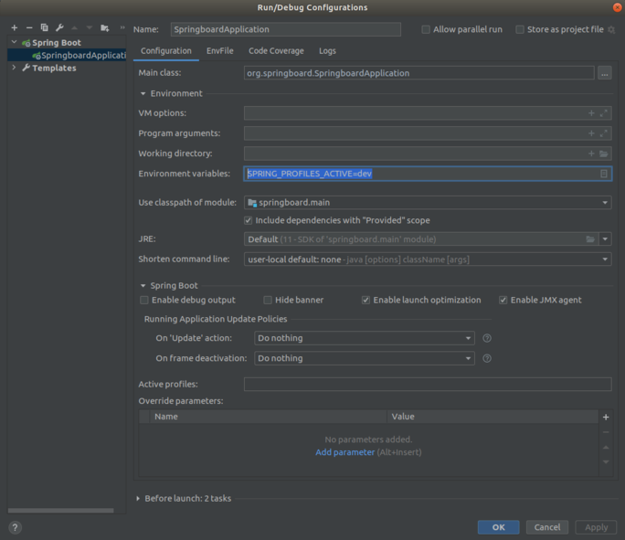](images/getting-started-run-configuration.png)

Save and let's try running with the new configuration changes.

Again! Horrible errors:

[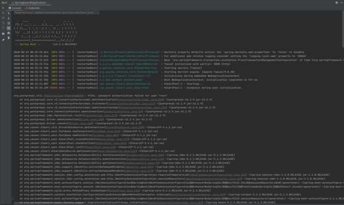](images/getting-started-dev-profile-db-down.png)
 
Looking at the error messages, the root error here is:
 
 ```
Unable to obtain connection from database: FATAL: password authentication failed for user "root"
 ```

We forgot to start the database- so it's unable to connect when trying to login. The database runs in a docker-container
 that we can start up using docker-compose. 

Using the terminal, go to the main project directory (rvroger in my case) then run the following command to bring
 up the database:
 
[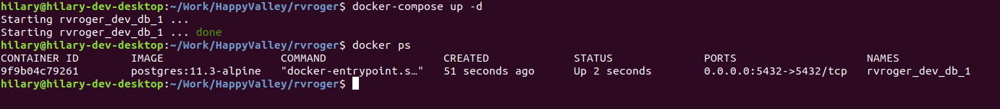](images/getting-started-docker-startup.png)

Now we have the database up and running, let's finally start our application. Going back to Intellij, we re-run our 
SpringboardApplication with the edited configuration to pickup the dev credentials - and now we have the actual 
application started successfully.


[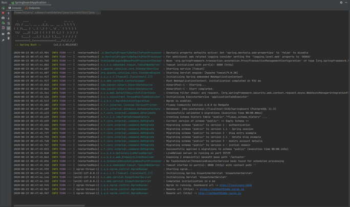](images/getting-started-application-start-successful.png)

Now open "http://localhost:8080" in your browser and you can see we have the Springboard starter running! We can even 
create a new account and login.

[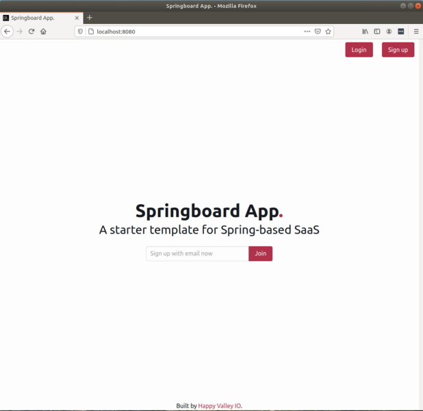](images/getting-started-initial-website-landing-page.png)

[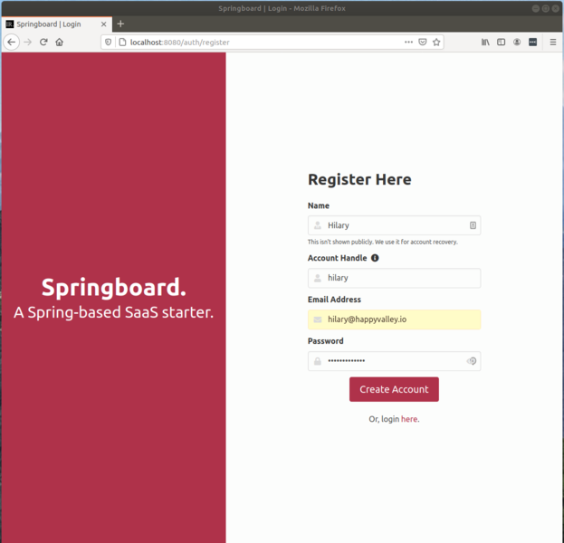](images/getting-started-initial-register-page.png)

[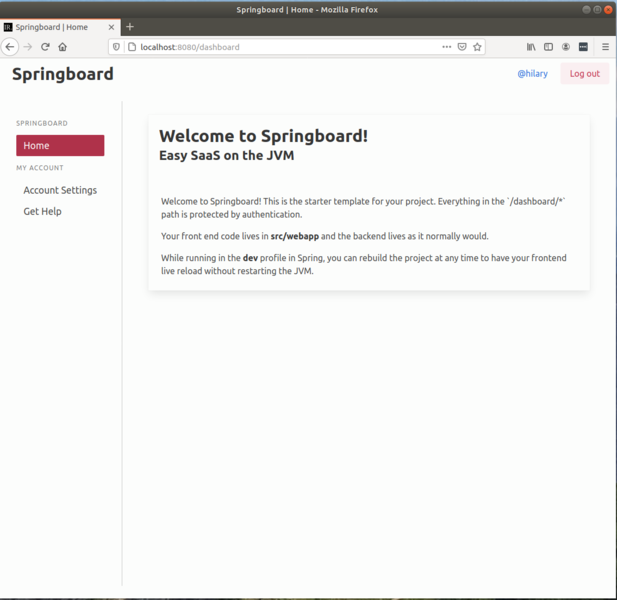](images/getting-started-initial-logged-in-page.png)

That's it! You have a basic application with a website homepage, account registration and a basic dashboard upon logging in.

Now we have the project running, let's customize the project a bit, so it isn't just a basic Springboard Template.

## Customize the Project - Database Name
I started my career as a database developer - so I'm going to start with the dev database setup. Let's rename it from 
"springboard" to our project name (rvroger in my case)

Open docker-compose.yml and on line 11 the database name is specified.

[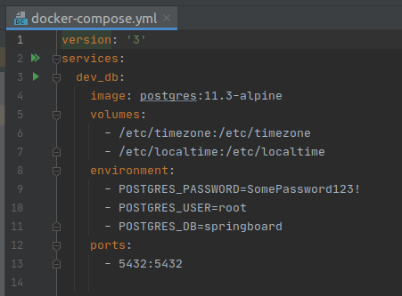](images/customize-database-name.png)

I'm going to replace the db name from "springboard" to "rvroger" and then we will need to restart our database.

In the main project directory in the terminal- bring down the current docker stack:
```
docker-compose down
```
Then bring it back up with
```
docker-compose up -d
```

[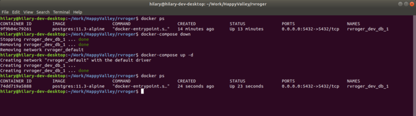](images/customize-database-name-docker-commands.png)

Now, we have to tell the application dev setup to use the new database name. This is done by editing the 
application-dev.properties file. The datasource url needs to be updated to use the new database name.

[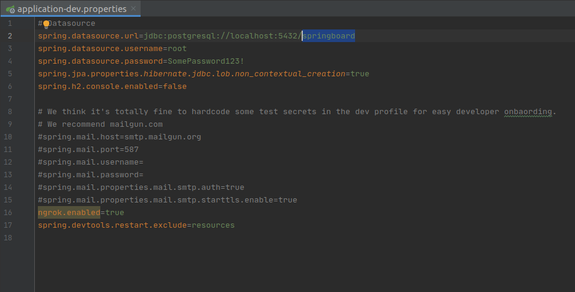](images/customize-database-name-dev-properties.png)

Now we can rebuild the project, either with the IntelliJ run buttons or "CTRL+F9" and we are back up and running, with a 
newly named Dev database.


## Customize the Project - Change the Applications Primary Color

This is a bit of a silly change- but it's important to make your application feel like it is yours. So we are going to 
change the primary color used by all the UI for the project.

The variables used by all the SCSS in this project are within the "src/webapp/src/styles/components" directory in the 
"variables.scss" file.

[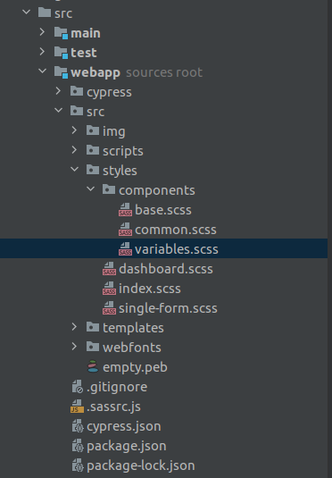](images/scss-variables.png)

If you open the variables.scss file, we can see that there are a number of color variables listed.

[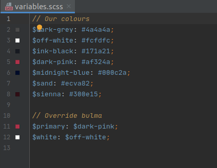](images/variables-scss-file.png)

We are just going to change one right now- the $primary variable. This variable controls the color of all attributes on 
the project marked as "primary". With the basic existing Springboard project, this is mainly going to affect things like 
button colors and backgrounds.

Before we make this change- make sure you have an instance of SpringboardApplication up and running. We want to see 
this change happen live.

Initially- your website is going to look like this:

[](images/getting-started-initial-website-landing-page.png)

I've created a new variable for this project called "rvroger-blue". This gives me the option of referencing this color 
for things other than primary classes in the future. Then I set the $primary variable to my new $rvroger-blue variable.

[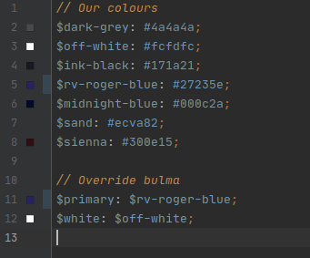](images/updated-variables.png)

Hit 'CTRL + F9' to rebuild the project - and watch the browser change from the Springboard maroon/red to our new primary blue color.

[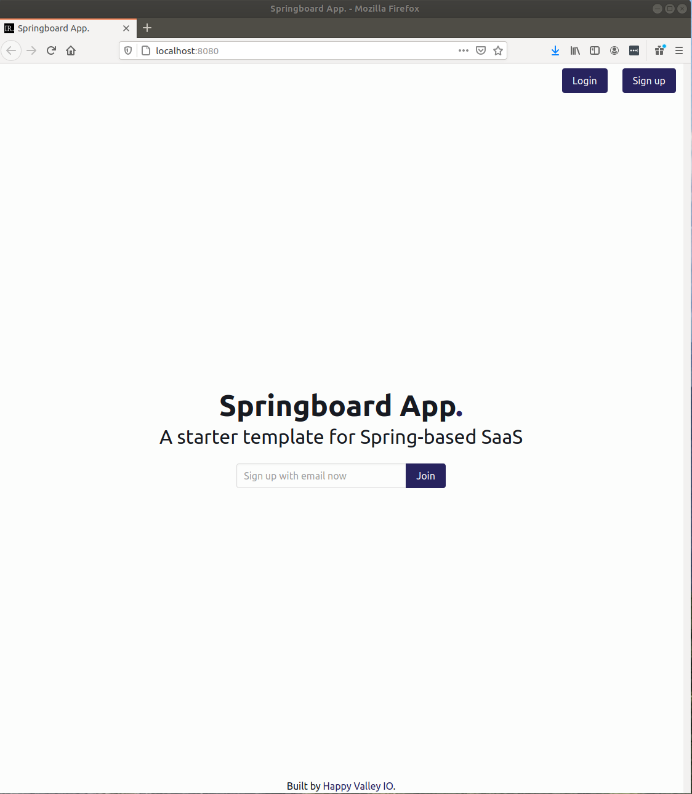](images/updated-primary-variable-landing-page.png)

That's just a starting point- but it lets you see how easily you can start to customize Springboard to get your 
application moving quickly. Changing something as simple as the primary project color starts to make the project feel 
like *your* application, not just a template.


# Next Steps
Now that you've got things going, why not learn [how to write a cypress test](cypress.md) or [how to deploy to production with heroku](../deploy/heroku.md)?
